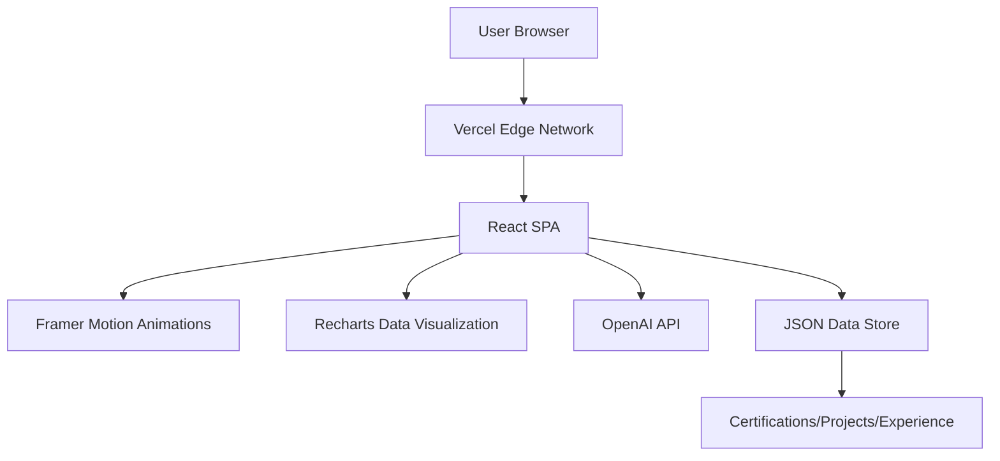

<div align="center">

# 🌌 Monishwaran K | Developer Portfolio
**Crafting High-Performance Digital Experiences with Precision & Artistry**

[](https://reactjs.org/)
[](https://www.typescriptlang.org/)
[](https://tailwindcss.com/)
[](https://www.framer.com/motion/)
[](https://vercel.com/)

<p align="center">
  <a href="#-features">Features</a> • 
  <a href="#-tech-stack">Tech Stack</a> • 
  <a href="#-architecture">Architecture</a> • 
  <a href="#-getting-started">Getting Started</a>
</p>

---

</div>

## 👨‍💻 About Me
A passionate Full-Stack Developer dedicated to building scalable, interactive, and visually stunning web applications. This portfolio is a living testament to my technical journey, blending high-performance engineering with fluid user experiences. I specialize in bridging the gap between complex backend logic and intuitive frontend design.

> **Core Philosophy:** Code should not only be functional but an experience. From the micro-interactions of a button to the architecture of a database, every detail matters.

---

## 🚀 Features

| Feature | Description | Tech Used |
| :--- | :--- | :--- |
| **✨ Dynamic Typewriter** | Engaging, cycling taglines that introduce roles and specialties. | `react-simple-typewriter` |
| **📊 Tech Stack Radar** | A visual, data-driven radar chart representing proficiency levels. | `recharts` |
| **🛠 Interactive Skills** | Clickable skill matrix with deep-dive modals for project context. | `framer-motion` |
| **🌌 Particle Background** | Immersive, interactive visual layer for a premium futuristic feel. | `Canvas/React` |
| **🔍 Global Search** | Instant access to projects, certifications, and experience. | `Custom Search Logic` |
| **📄 PDF Export** | Ability to generate/export professional resumes on the fly. | `html2pdf.js` |
| **🤖 AI Integration** | Integrated OpenAI capabilities for an interactive AMA experience. | `openai` |

---

## 🛠 Tech Stack

### 🎨 Frontend & UI
- **Core:** React 18, TypeScript
- **Styling:** Tailwind CSS, PostCSS
- **Animations:** Framer Motion (Fluid transitions & layout animations)
- **Icons:** Lucide React

### ⚙️ Backend & Infrastructure
- **Deployment:** Vercel, Docker
- **Database/BaaS:** MongoDB, PostgreSQL, Firebase, Supabase, Convex
- **API/CMS:** Strapi, Node.js
- **State Management:** Zustand, Redux

### 🛠 Tooling
- **Build Tool:** Vite
- **CI/CD:** GitHub Actions
- **Design:** Figma

---

## 🏗 Architecture



### 📂 Folder Structure
<details>
<summary>Click to expand file tree</summary>

```text
.
├── .github/workflows       # CI/CD Pipelines (GitHub Pages/Vercel)
├── public/                # Static Assets
│   ├── certifications/    # Professional Credentials (.webp)
│   ├── events/           # Event Participation images
│   ├── projects/         # Project Showcases
│   └── icons/            # Tech Stack & Social Icons
├── src/
│   ├── components/       # Atomic UI Components
│   │   ├── Navbar.tsx    # Navigation & Routing
│   │   ├── ParticleBackground.tsx # Visual Effects
│   │   ├── TechStackRadar.tsx # Data Viz
│   │   └── SkillModal.tsx # Detail Overlays
│   ├── data/             # Static Content
│   │   └── certifications.json # Structured Cert Data
│   └── App.tsx           # Root Application Logic
├── Dockerfile            # Containerization config
└── package.json          # Dependency Management
```
</details>

---

## 🚀 Getting Started

### Prerequisites
- **Node.js** (v18.0.0 or higher)
- **npm** or **yarn**

### Installation & Local Development
```bash
# Clone the repository
git clone https://github.com/dharunkumar-sh/dharun-portfolio.git

# Enter the directory
cd dharun-portfolio

# Install dependencies
npm install

# Start the development server
npm run dev
```

### Production Build
```bash
# Build for production
npm run build

# Preview the production build locally
npm run preview
```

---

## 🐳 Docker Deployment
The project is containerized for consistent deployment across any environment.

```bash
# Build the image
docker build -t dharun-portfolio .

# Run the container
docker run -p 80:80 dharun-portfolio
```

---

## 📈 Performance & Quality
- **Type Safety:** Fully implemented TypeScript for zero-runtime errors.
- **Responsive Design:** Mobile-first approach ensuring seamless experience across devices.
- **Optimized Assets:** All images converted to `.webp` for lightning-fast load times.
- **CI/CD:** Automated deployment pipeline via GitHub Actions.

---

## 🤝 Contributing
Contributions are welcome! Please feel free to open an issue or submit a pull request.

1. Fork the Project
2. Create your Feature Branch (`git checkout -b feature/AmazingFeature`)
3. Commit your Changes (`git commit -m 'Add some AmazingFeature'`)
4. Push to the Branch (`git push origin feature/AmazingFeature`)
5. Open a Pull Request

---

## 📜 License
This project is proprietary. All rights reserved.

<div align="center">
  <br />
  <sub>Built with ❤️ by <a href="https://github.com/dharunkumar-sh">Monishwaran K</a></sub>
</div>
